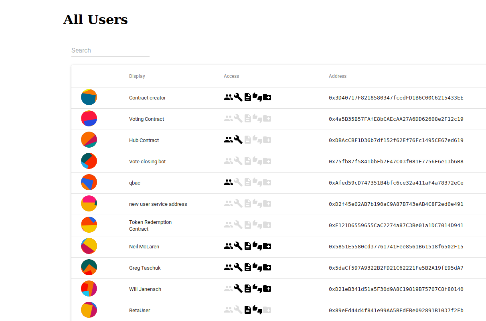
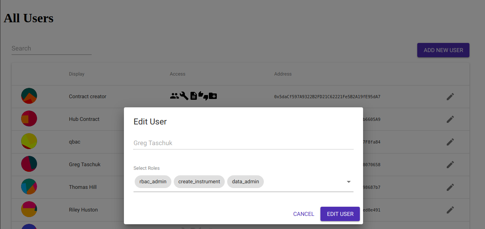

# bitmask-rbac-portal

This is an example interface for interacting with a bitmask-rbac.  You may wish to modify the code to fit your use of the bitmask rbac provided in the parent folder (and let us know!).



The app assumes you are connected with metamask to the ethereum blockchain that your rbac is deployed on.

It will display admin functionality if you are signed in with metamask as an admin user in the app (by default the user that deploys the rbac contract is an admin).




## Setup

Before you set up this application, you should deploy a bitmask-rbac from the root of this repository.  [https://github.com/TruSet/bitmask-rbac/](https://github.com/TruSet/bitmask-rbac/)

Then, create a `.env` file that contains the address of the contract, and the address of the node, such as one you get from infura, that you wish the app to connect to:

```bash
// .env
REACT_APP_RBAC_ADDRESS_4=0x799Cb27e1C651E01E1D6a70696b2A6BE49952341
REACT_APP_WEBSOCKETS_ENDPOINT_4=wss://rinkeby.infura.io/ws/v3/<redacted>
```

Note the suffix `_4` on the variable names above.  This indicates the network which the application will use.  Use the appropriate suffix for the environment where the contract is deployed ie `_1` for Mainnet, `_4` for rinkeby, `_100` for xDai.

You can change the roles that the application references in [/src/services/UserService.js](https://github.com/TruSet/bitmask-rbac/tree/master/portal/src/services/UserService.js) and the relevant material-ui icons in [/src/components/UserTable.js](https://github.com/TruSet/bitmask-rbac/tree/master/portal/src/components/UserTable.js) - keep them updated as you add roles.
